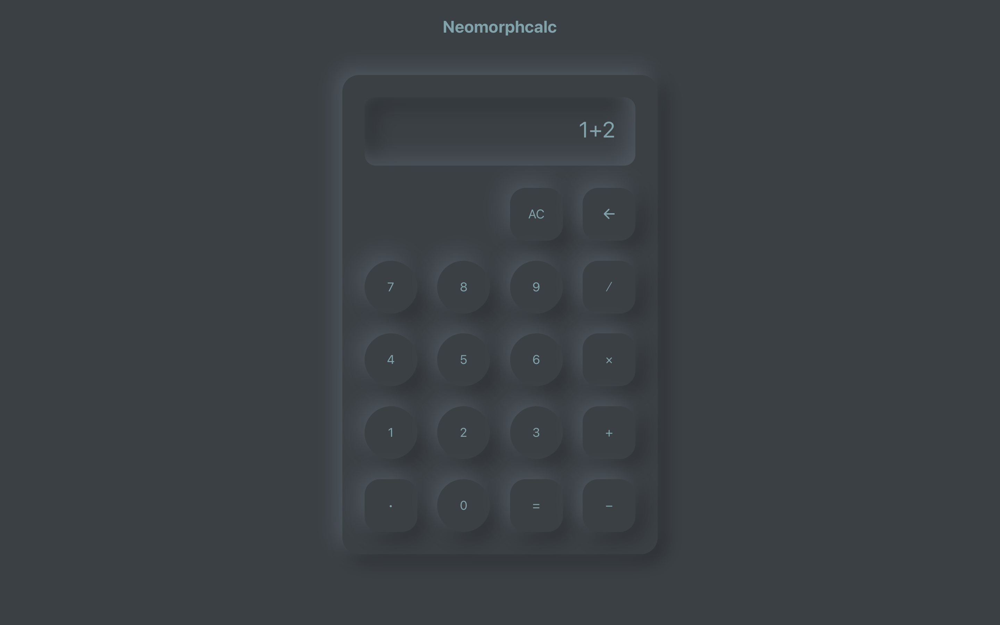

## Neomorphcalc

Calculator built in React with soft, minimal UI, custom expression parser and
evaluator.

### Features

- **Custom Expression Parser** (supports unary & binary operations)
- **Neumorphic UI** - minimal, soft & clean
- **Keyboard support**

### Live Demo

Check live at [neomorph-calc.netlify.app/](https://neomorph-calc.netlify.app/)
& development previews at [preview--neomorph-calc.netlify.app/](https://preview--neomorph-calc.netlify.app/).

### Stack

- React, SCSS, Vite, Netlify
